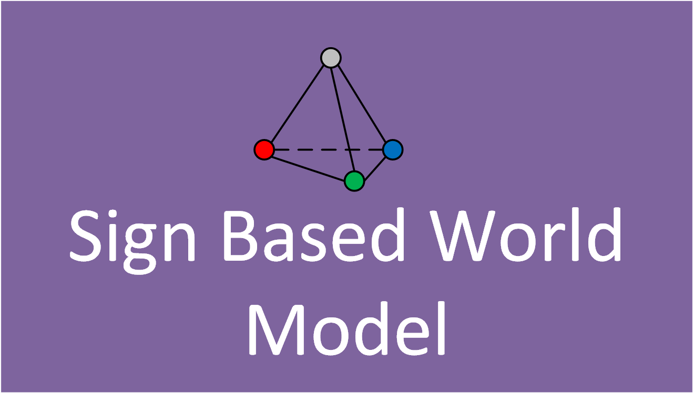

**Sign world model** is a psychologically plausible way 
of representing the knowledge of a cognitive agent. The method was 
developed on the basis of the work of outstanding Soviet and 
Russian psychologists and neurophysiologists. In more detail, 
about a sign world model you can find in:
1. [Знаковая картина мира субъекта поведения.](content/book1.pdf)
2. [Управление поведением как функция сознания 1. Картина мира и целеполагание.](content/swm2014.pdf)
3. [Управление поведением как функция сознания 2. Синтез плана поведения.](content/swm2015.pdf)
4. [Знаковый подход к задаче распределения ролей в
коалиции когнитивных агентов.](content/roles2017.pdf)

All feedback you can send to [email](mailto:kiselev@isa.ru)